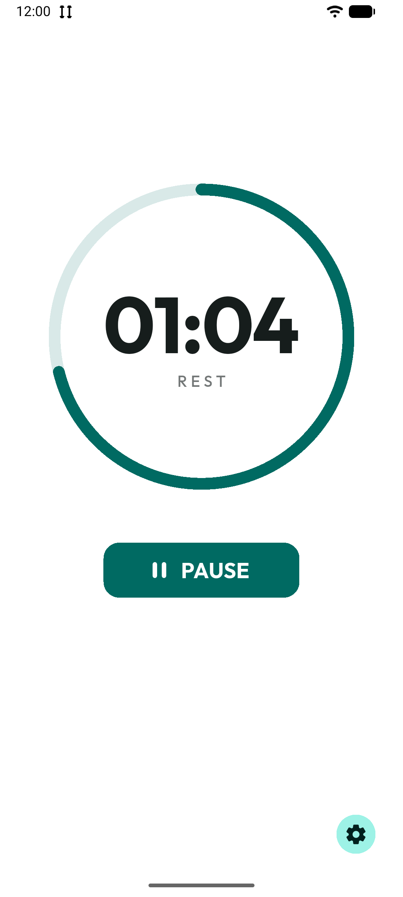
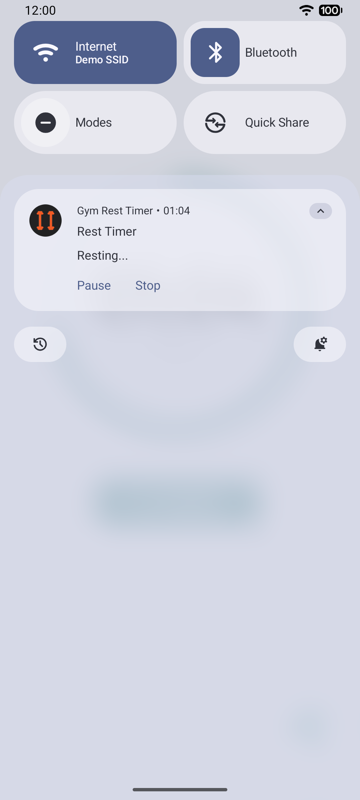
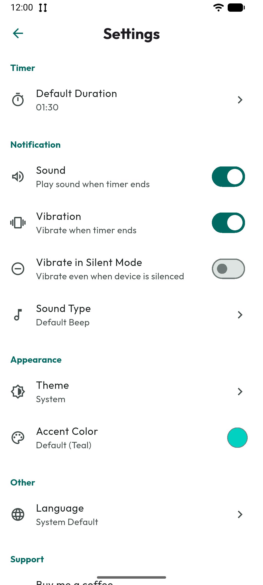
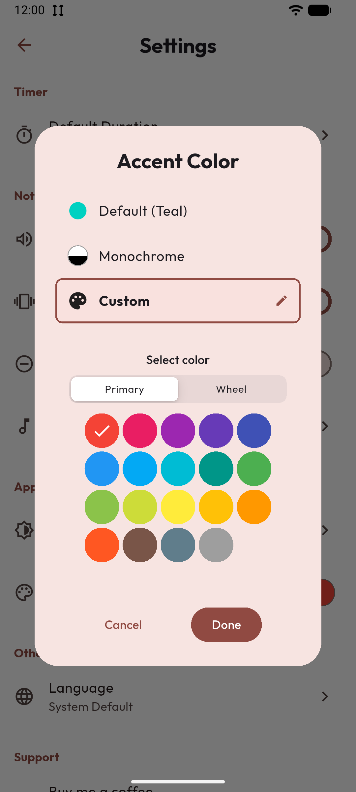
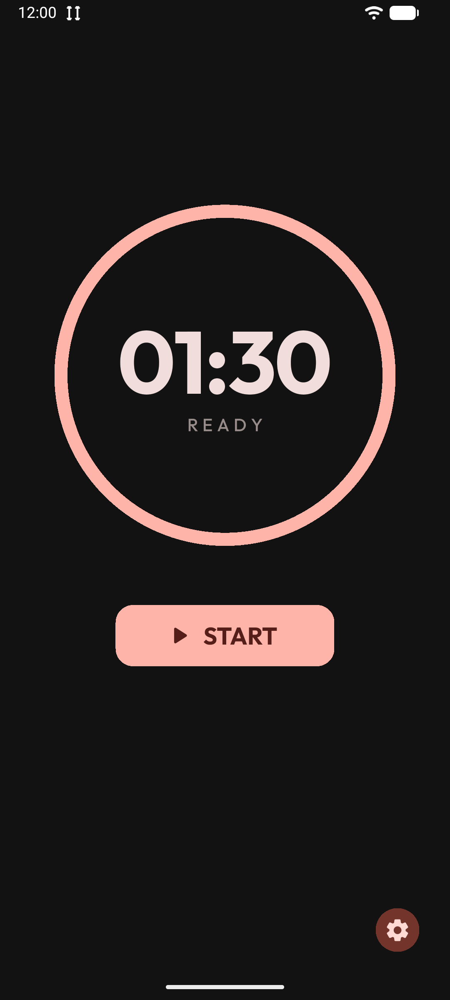

# Gym Rest Timer


[](https://ko-fi.com/davidefalconi)

**Gym Rest Timer** is a clean, distraction-free workout rest timer built with Flutter.

## ✨ Features

- **Timer**:  Simple, configurable rest duration
- **Notifications**:  See the countdown in your notification tray
- **Notification Controls**:  Pause, resume, or reset directly from the notification shade
- **AMOLED Black Mode**:  Pure black theme for OLED screens and battery savings
- **Accent Colors**:  Choose from preset colors or pick your own, including a "Monochrome" mode
- **Custom Sounds**:  Select from built-in sounds or pick your own audio file
- **Vibration**:  Get vibration feedback when your rest is over
- **Localization**:  Supports English and Italian with in-app language selector
- **Open Source Licenses**:  View all third-party licenses in-app
- **Persistent Settings**:  Your preferences are saved locally

## 📸 Screenshots

<table align="center">
  <tr>
    <td align="center">
      <br />
      <b>Home Screen</b>
    </td>
    <td align="center">
      <br />
      <b>Timer Running</b>
    </td>
    <td align="center">
      <br />
      <b>Native Live Notification</b>
    </td>
  </tr>
  <tr>
    <td align="center">
      <br />
      <b>Settings</b>
    </td>
    <td align="center">
      <br />
      <b>Custom Accents</b>
    </td>
    <td align="center">
      <br />
      <b>Amoled Black Theme</b>
    </td>
  </tr>
  <tr>
    <td align="center">
      <br />
      <b>Dark Theme</b>
    </td>
    <td align="center"></td>
    <td align="center"></td>
  </tr>
</table>

## 📥 Installation

Download and install the latest release [here](https://github.com/davidefalconi69/gym_rest_timer/releases).

## 🛠️ Clone & Run

```bash
# Clone the repository
git clone https://github.com/davidefalconi69/gym_rest_timer.git
cd gym_rest_timer

# Install dependencies
flutter pub get

# Generate localization files
flutter gen-l10n

# Run the app
flutter run
```

## 🔒 Privacy

**Your privacy is respected.**

- No data collection
- No analytics
- No network requests
- No accounts required

## 📄 License

This project is licensed under the [GNU General Public License v3.0](LICENSE).
